# Robotics UI

- [Robotics UI](#robotics-ui)
  - [Installation Guide](#installation-guide)
    - [Requirements](#requirements)
    - [Install dependencies](#install-dependencies)
    - [Download the Robotics UI Package](#download-the-robotics-ui-package)
    - [Install the Robotics UI Backend](#install-the-robotics-ui-backend)
    - [Install the Robotics UI Frontend](#install-the-robotics-ui-frontend)
  - [Start the Application](#start-the-application)
    - [Start the Robotics UI Backend](#start-the-robotics-ui-backend)
    - [Start the Robotics UI Frontend](#start-the-robotics-ui-frontend)
    - [Configure the web address](#configure-the-web-address)
  - [User Guide](#user-guide)
    - [Configure the Dashboard (JSON Configuration file)](#configure-the-dashboard-json-configuration-file)
      - [Upload existing Configurations](#upload-existing-configurations)
      - [Configure the JSON File](#configure-the-json-file)
      - [Use the Configuration File](#use-the-configuration-file)
      - [Use the Configuration File in the Backend](#use-the-configuration-file-in-the-backend)
  - [Plugins](#plugins)
    - [Open Street Map Center](#open-street-map-center)
    - [Generic Plugin and String Plugin](#generic-plugin-and-string-plugin)
    - [Planned Plugins](#planned-plugins)
    - [Plugin Guide](#plugin-guide)
  - [Supported ROS 2 Message Formats](#supported-ros-2-message-formats)
    - [ROS 2 to JSON](#ros-2-to-json)
    - [JSON to ROS 2](#json-to-ros-2)
  - [Future Plans](#future-plans)


Robotics UI is a web interface solution for ROS 2 powered robots using React and ROS 2 Iron.

Our vision is to create software that allows you to instantly add a web interface to every ROS 2 robot by configuring a simple JSON file.

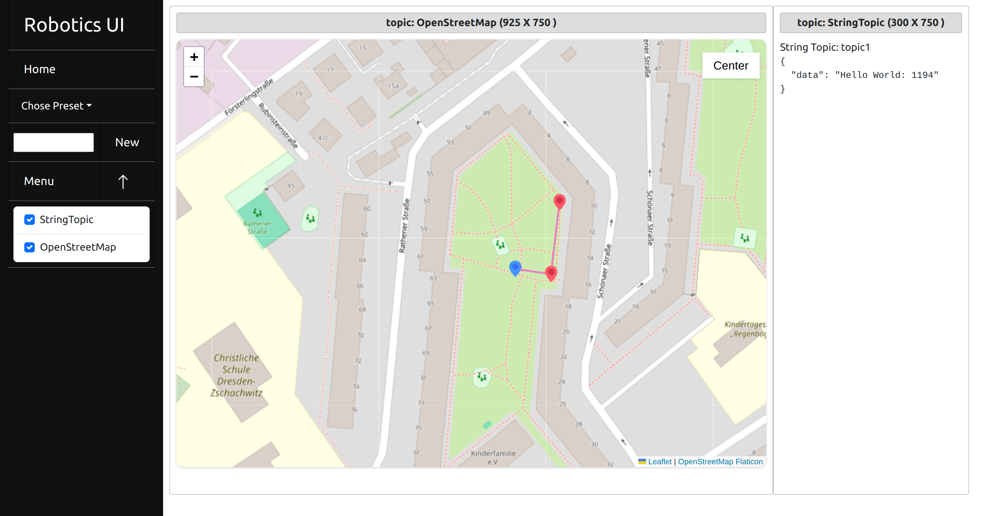

The tool consists of two parts: a Python backend, which acts as a translation layer between ROS 2 and the React frontend. To achieve this, we are translating ROS 2 messages into JSON and back.

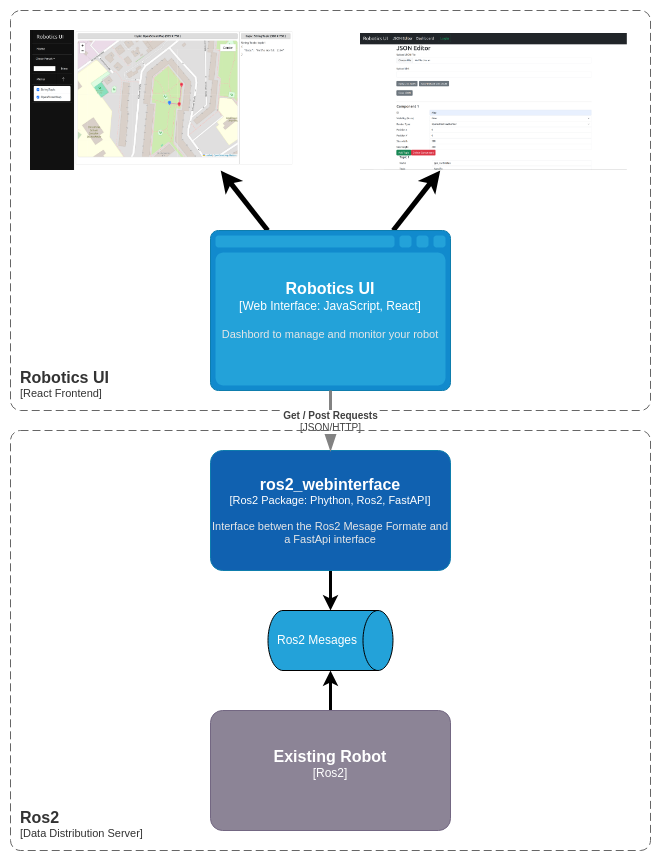

In the frontend, we use a window-based design where each window is its own micro program interfacing with the JSON data from the backend. This allows us to take a plugin-style approach and for the user to customize their dashboard. The goal is for users to create their own custom plugins.

There is also phone support featuring a more compact design.

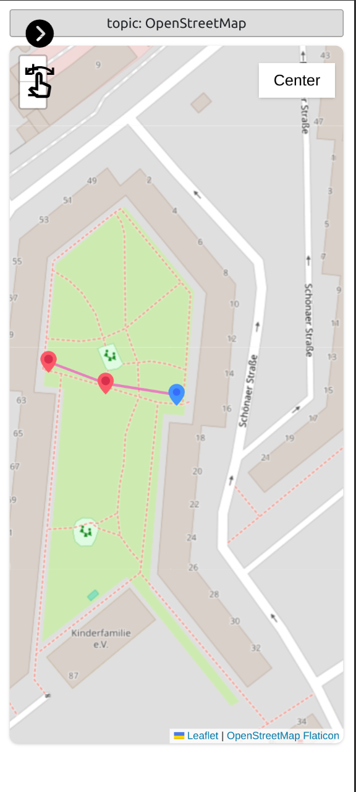

## Installation Guide

### Requirements

- ROS 2 Iron

[ROS 2 Iron Setup we use](./docs/Robot_Setup.md)

### Install dependencies

To use the ROS 2 packages, you need to install the following packages:

Setup ROS
```bash
export ROS_DISTRO=iron
```

Setup FastAPI
```bash
sudo apt install python3-pip
pip install fastapi

pip install uvicorn 
```
Other Dependencies
```bash
pip install pyyaml
```

Install NVM
```bash
sudo apt update
curl -o- https://raw.githubusercontent.com/nvm-sh/nvm/v0.35.3/install.sh | bash
nvm install node
```

### Download the Robotics UI Package

Navigate to your ROS 2 workspace src folder and download the package

```bash
cd ~/ros2_ws/src
git clone https://github.com/sciotaio/robotics-ui.git
```

### Install the Robotics UI Backend

Navigate to your workspace folder and install the `ros2_webinterface` package

```bash
cd ~/ros2_ws
colcon build --packages-select ros2_webinterface && source install/setup.bash
```

### Install the Robotics UI Frontend

Navigate to the React Project folder 

```bash
cd ~/ros2_ws/src/robotics-web/react/robotics_ui/
```

Install the dependencies with npm

```bash
npm install
```

## Start the Application

### Start the Robotics UI Backend

```bash
# test launch
ros2 launch ros2_webinterface test.launch.py
# main launch (only the webinterface)
ros2 launch ros2_webinterface webinterface.launch.py
# waypoint_manager launch (Backend for the OpenStreetMap Plugin)
ros2 launch ros2_webinterface waypoint_manager.launch.py
```

### Start the Robotics UI Frontend

```bash
cd ~/ros2_ws/src/robotics-web/react/robotics_ui/
npm start
```

### Configure the web address

TODO: Explain how to change the Host and Proxy settings and how to change the backend address 

## User Guide

The user guide explains how to customize the application and how to use it in your project.

### Configure the Dashboard (JSON Configuration file)

This guide explains how to create and configure the JSON configuration file to create your custom dashboard.

Start the frontend and open it in a web browser (default address http://localhost:3000/)

The following page should open:

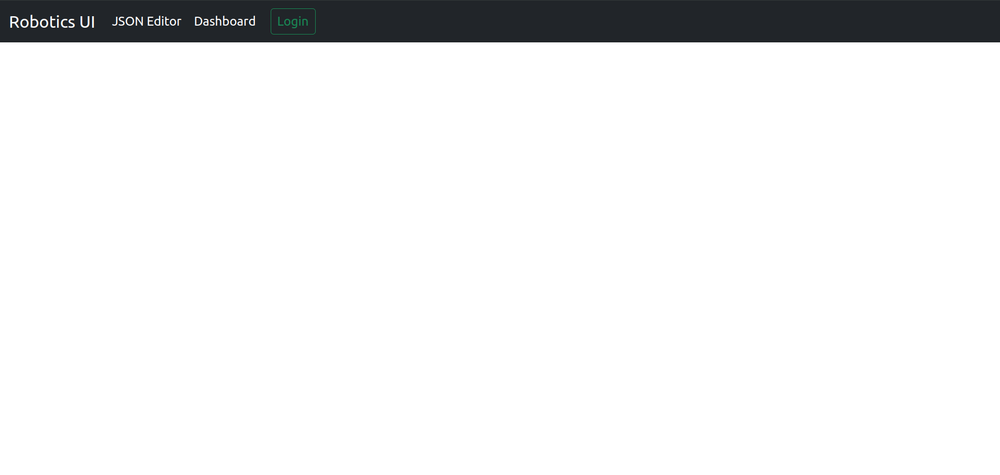

Go to the section JSON Editor.

In the JSON Editor, you have multiple options:

#### Upload existing Configurations

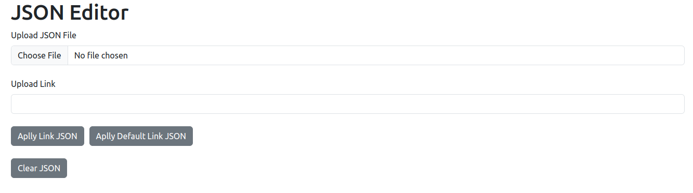

You can either upload a JSON configuration file or a Dashboard Link.

Dashboard Links include the configuration JSON as link parameters. For example: http://localhost:3000/dashboard/settings?component=[{"id":"StringTopic","state":false,"render_type":"String","position":{"x":0,"y":0},"size":{"width":200,"height":200},"topic":[{"name":"topic1","topic":"/topic1","type":"String","route":"/subscriber/topic1"}]}]&preset_list=undefined 

To apply the Link JSON, you can then click the "Apply Link JSON" button.

Or you can use the "Apply Default Link JSON" button to choose the pre-saved demo link.

#### Configure the JSON File


To configure the JSON file, you can use the web form.

As an introduction, let's add a simple component:

- First, press the "Add Component" button (this will add a simple default component).

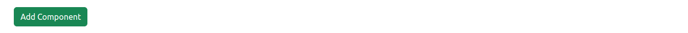

- After that, you have to set the ID of the component. The ID acts as the display name in the dashboard selection list, so it has to be unique.

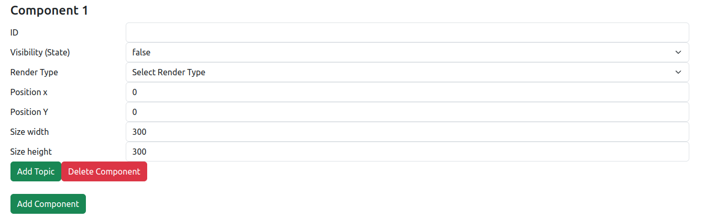

- Besides the ID, you have options to set the visibility, the position, and the size of your component. These options are used to set the default position in the dashboard and can be ignored for now.

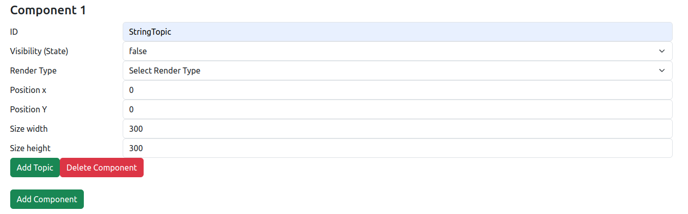

- After that, you have to choose the Render Type. The Render Type defines what plugin is used for the component. In our example, we are choosing the String Render Type.

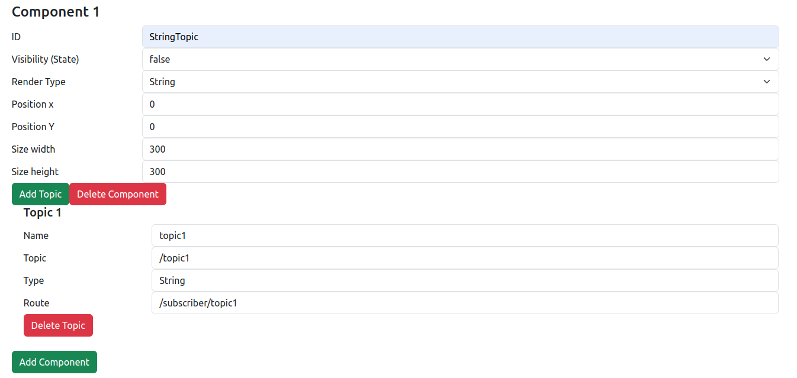

- In our case, the String Render Type comes with a preconfigured Topic.

- Next, we have to configure the topics of the component. Topics give the frontend the information needed to make API calls to the backend, and they each have 4 properties:
  - The Name property is the identifier of your topic.
  - The Topic property is the name of your topic in ROS 2 and allows the backend to create the appropriate subscriber/publisher.
  - The Type property defines the ROS 2 message type the topic uses.
  - The Route property defines how the frontend accesses the backend. The format is either "/subscriber/<topic_name>" or "/publisher/<topic_name>". It is also used to define if the backend creates a subscriber or a publisher.
- The number and order of topics is defined by the type of plugin we are using, so consult the plugin documentation for that information.

- If we want to delete or add topics, we can use the "Add Topic" or "Delete Topic" buttons.

#### Use the Configuration File

To use the configuration, we have multiple options:

- With the "Generate JSON" button, we can print the JSON file to the Dev Tool console.

- With the "Download JSON" button, we can download the JSON file.

- With the "Use JSON" button, we can directly open the dashboard with the configured settings.

- If you want to access the same exact dashboard in the future, you can also simply copy the link in the Link section.

#### Use the Configuration File in the Backend

To use a custom configuration file in the backend, you have to set this as a property in your custom launch file.

An example launch file could look something like this:

```python
import os
from launch import LaunchDescription
from launch_ros.actions import Node
from launch.actions import IncludeLaunchDescription
from launch.launch_description_sources import PythonLaunchDescriptionSource
from ament_index_python.packages import get_package_share_directory

def generate_launch_description():    
    share_dir = get_package_share_directory('ros2_webinterface')    
    launch_dir = os.path.join(share_dir, 'launch')
    
    webinterface = IncludeLaunchDescription(
        PythonLaunchDescriptionSource(
            os.path.join(launch_dir, 'webinterface.launch.py')
        ),
        launch_arguments={
            "yaml_config": "topic_list.yaml", # Name of the YAML config

 file
            "json_config": "topic_list.json", # Name of the JSON config file
            "config_folder": 'default',       # Path to the folder
                                              # or 'default' to use the 
                                              # standard config folder
        }.items(),
    )
    
    ld = LaunchDescription()    
    ld.add_action(webinterface)
    return ld
```

The YAML file can be empty—it gets automatically overwritten with the correct config on launch.

## Plugins

Plugins allow you to customize your dashboard even further.

The app currently comes with 3 different plugins.

### Open Street Map Center 

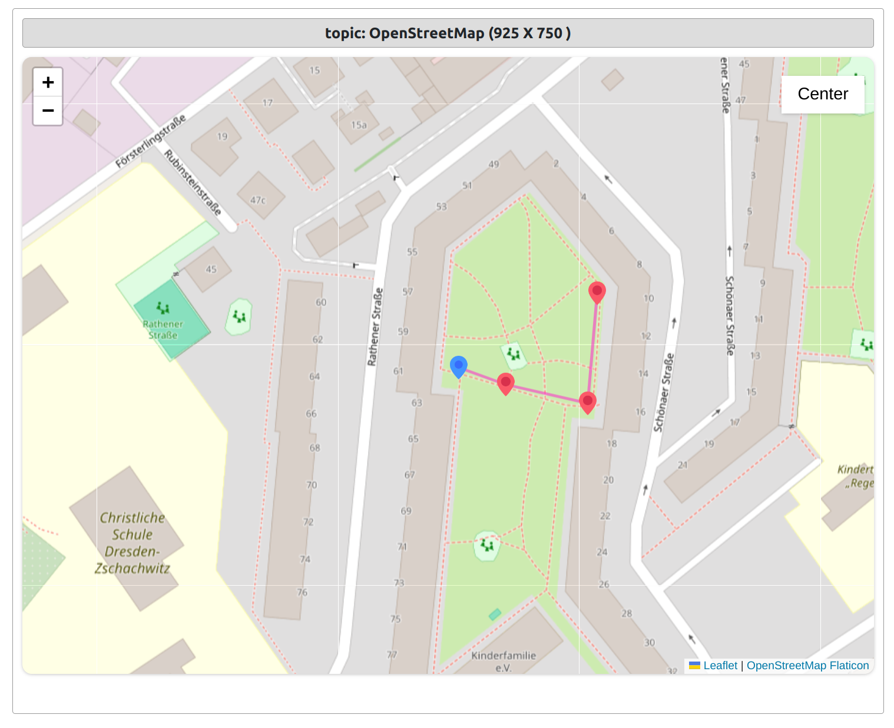

[Open Street Map Plugin Guide](./docs/Plugins/OpenStreetMap_Plugin_Guide.md)

The Open Street Map Center allows you to track your robot on the map and send GPS waypoint instructions with a simple click.

You can also center on the robot with the center button as well as delete and set waypoints.

### Generic Plugin and String Plugin

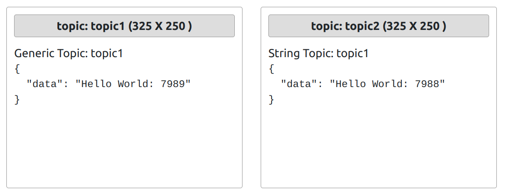

This plugin allows you to simply display the incoming JSON data.

### Planned Plugins

- Image Streamer 
- Waypoint Recorder (Tap a button to record your current location and plan a route for your robot)
- Route Manager (Save, edit, and load different routes for your robot)
- Controller Plugin (Connect a controller and publish the inputs as a ROS 2 topic)
- Customizable Information and Control Panel (Add simple information screens and buttons to your dashboard)

Please send us your suggestions for plugins.

### Plugin Guide

Guide on how to install and configure plugins:

[Plugin Guide](./docs/Plugins/Plugin_Guide.md)

## Supported ROS 2 Message Formats 

### ROS 2 to JSON

`std_msgs.msg`

- Bool
- Byte
- ByteMultiArray
- Char
- ColorRGBA
- Empty
- Float32
- Float32MultiArray
- Float64
- Float64MultiArray
- Header
- Int16
- Int16MultiArray
- Int32
- Int32MultiArray
- Int64
- Int64MultiArray
- Int8
- Int8MultiArray
- MultiArrayDimension
- MultiArrayLayout
- String
- UInt16
- UInt16MultiArray
- UInt32
- UInt32MultiArray
- UInt64
- UInt64MultiArray
- UInt8
- UInt8MultiArray

`sensor_msgs.msg`

- BatteryState
- CameraInfo
- ChannelFloat32
- CompressedImage
- FluidPressure
- Illuminance
- Image
- Imu
- JointState
- Joy
- JoyFeedback
- JoyFeedbackArray
- LaserEcho
- LaserScan
- MagneticField
- MultiDOFJointState
- MultiEchoLaserScan
- NavSatFix
- NavSatStatus
- PointCloud
- PointCloud2
- PointField
- Range
- RegionOfInterest
- RelativeHumidity
- Temperature
- TimeReference

### JSON to ROS 2

`std_msgs.msg` 

- String

More formats coming in future updates.

## Future Plans

- Expand the functionality of the Open Street Map Center and add the ability to save routes.
- Add support for more ROS message types.
- Add authentication to the system.
- Add a JSON editor.
- Add more default plugins like an image streamer.
